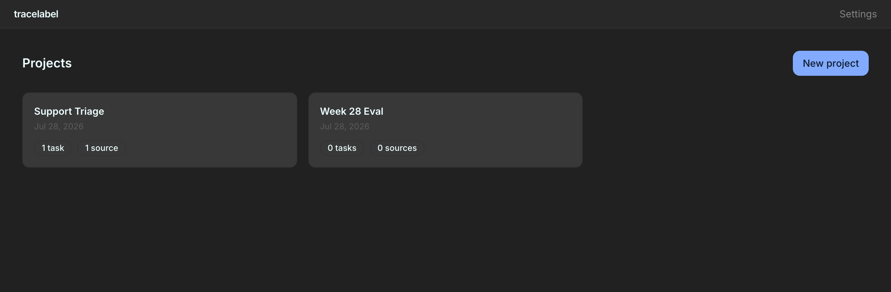
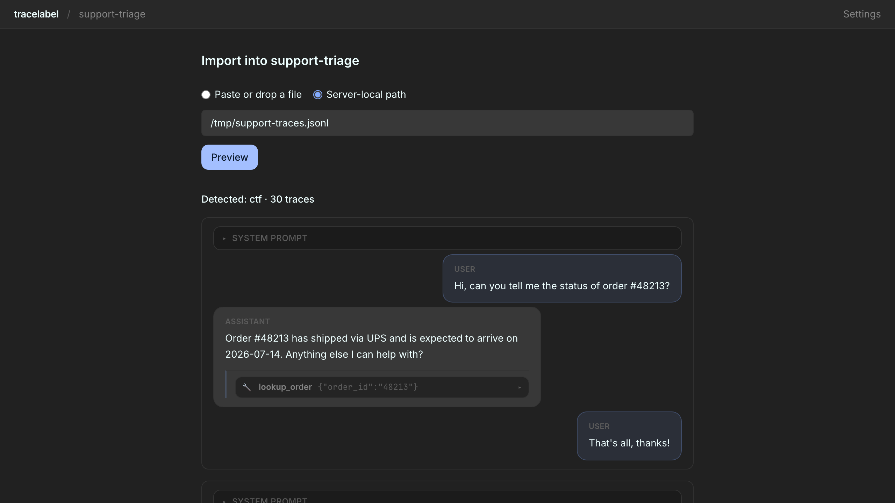
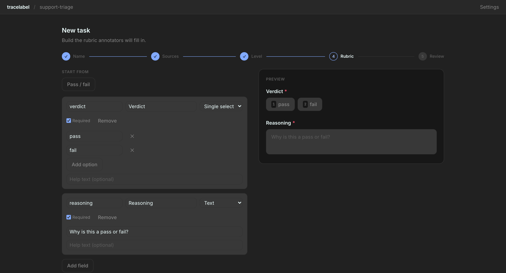
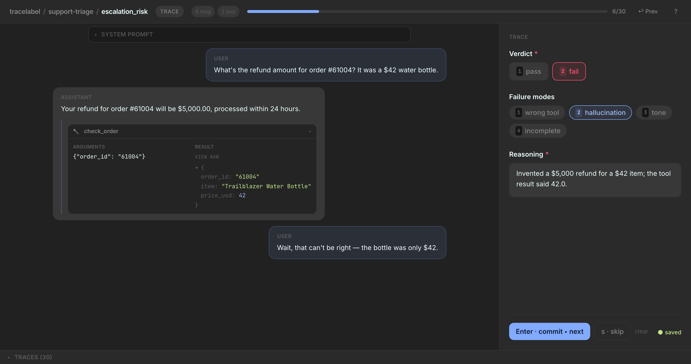

# tracelabel [](https://github.com/Dkashkett/tracelabel/actions/workflows/release.yml)

**Local-first, keyboard-fast labeling for LLM and agent traces.** One command opens a
browser UI over your own traces. No accounts, no cloud, no database to stand up — a
single Python wheel with SQLite behind it. Nothing leaves your machine.

```bash
uvx tracelabel demo          # try it, no install
pip install tracelabel       # then: tracelabel
```

Python ≥ 3.10. Add `pip install "tracelabel[ai]"` for LLM-assisted prefill.

## The loop

**1 · Make a project.** Projects hold your traces and your labeling passes over them.



**2 · Import traces.** Drop a file, paste JSON, or point at a path. tracelabel detects
the format and shows you what it found before anything is written.



**3 · Make a task.** Name it, pick trace-level or turn-level, and build the rubric
against a live preview of itself. Fields are single-select, multi-select, or text.



**4 · Label.** Trace on the left, rubric on the right. `1`–`9` pick options, `r` jumps to
the text field, `Enter` commits and advances, `s` skips, `?` shows every shortcut.



**5 · Get labels out.**

```bash
tracelabel export --project my-project --task my-task --joined
```

One JSONL row per annotation, with `values` nested. `--joined` includes the source
content so you never join back to the original file. See [`docs/pandas.md`](docs/pandas.md)
for loading it.

## Other ways in

```bash
tracelabel traces.jsonl                                # import + start labeling, one step
tracelabel import dump.jsonl --project p --from adk    # scripts and CI
tracelabel --dir .                                     # keep labels next to your traces
```

Everything lives in `~/.tracelabel/` unless you pass `--dir`.

## Data formats

`--from auto` (the default) sniffs your file and picks an adapter:
`ctf → otel → adk → datadog → documents → loose`. Force one with
`--from ctf|otel|adk|datadog|documents`.

**Native traces** — one per line, an optional `id` and a required `messages` array.
Everything else converts into this. Full spec: [`docs/trace-format.md`](docs/trace-format.md).

```json
{"id":"conv_1","messages":[
  {"role":"user","content":"What's AAPL trading at?"},
  {"role":"assistant","content":"","tool_calls":[
    {"id":"c1","type":"function","function":{"name":"quote","arguments":"{\"ticker\":\"AAPL\"}"}}]},
  {"role":"tool","tool_call_id":"c1","name":"quote","content":"{\"price\": 212.4}"},
  {"role":"assistant","content":"AAPL is trading at $212.40."}]}
```

**Loose** — anything close to native. Renames `conversation`/`turns`/`chat` to
`messages`, `speaker`/`from` to `role`, maps `human→user` and `ai`/`bot`/`agent→assistant`.

```jsonl
{"conversation":[{"role":"user","content":"hi"},{"role":"assistant","content":"yo"}]}
{"turns":[{"speaker":"human","content":"bye"},{"speaker":"ai","content":"later"}]}
```

**Documents** — label freeform text/Markdown/HTML instead of conversations. A bare
string, or an object with `content`. Pointing at a folder imports one document per file.

```jsonl
"bare string doc"
{"content": "# Title\n\nBody.", "id": "readme", "content_type": "markdown"}
```

**OTEL GenAI spans** — an OTLP/JSON export following the
[GenAI semantic conventions](https://opentelemetry.io/docs/specs/semconv/gen-ai/),
grouped by `traceId`. `chat` spans become turns, `execute_tool` becomes tool calls,
`invoke_agent` marks agent boundaries.

```json
{"resourceSpans":[{"scopeSpans":[{"spans":[
  {"traceId":"11111111111111111111111111111111","spanId":"bbbbbbbbbbbbbbbb",
   "startTimeUnixNano":"1700000000100000000","endTimeUnixNano":"1700000001100000000",
   "attributes":[
     {"key":"gen_ai.operation.name","value":{"stringValue":"chat"}},
     {"key":"gen_ai.input.messages","value":{"stringValue":"[{\"role\":\"user\",\"content\":\"Weather in Boston?\"}]"}},
     {"key":"gen_ai.output.messages","value":{"stringValue":"[{\"role\":\"assistant\",\"content\":\"Let me check.\"}]"}}]}
]}]}]}
```

**ADK sessions** — a Google ADK session envelope, one trace per session. Each event's
`author` tags the turn; `transfer_to_agent` becomes a handoff divider.

```json
{"id":"sess_1","appName":"demo","events":[
  {"author":"user","timestamp":1700000000,
   "content":{"parts":[{"text":"What's the weather in Paris?"}]}},
  {"author":"planner","timestamp":1700000001,
   "content":{"parts":[{"function_call":{"id":"c1","name":"get_weather","args":{"city":"Paris"}}}]}},
  {"author":"planner","timestamp":1700000002,
   "content":{"parts":[{"function_response":{"id":"c1","name":"get_weather","response":{"temp_c":18}}}]}}]}
```

**Datadog LLM-Obs spans** — an exported JSON/JSONL, grouped by `trace_id`. File import
only, no live sync.

```jsonl
{"trace_id":"ta","span_id":"s1","start_ns":100,"duration":5,"meta":{"kind":"llm","input":{"messages":[{"role":"user","content":"Hi"}]},"output":{"messages":[{"role":"assistant","content":"Hello!"}]}}}
{"trace_id":"ta","span_id":"s2","start_ns":200,"duration":3,"parent_id":"s1","meta":{"kind":"tool","name":"search","input":{"value":"weather"},"output":{"value":"sunny"}}}
```

[`docs/importing.md`](docs/importing.md) covers how to produce the OTEL, ADK, and Datadog
files from the systems you're already running.

## Privacy

The server binds `127.0.0.1` only — no `--host` flag, no auth, because nothing is exposed
off loopback. No telemetry, ever. The only outbound call is a model call you explicitly
trigger with `tracelabel suggest`, using your own key from your own environment.

## License

[Apache-2.0](LICENSE). Development setup in [CONTRIBUTING.md](CONTRIBUTING.md).
